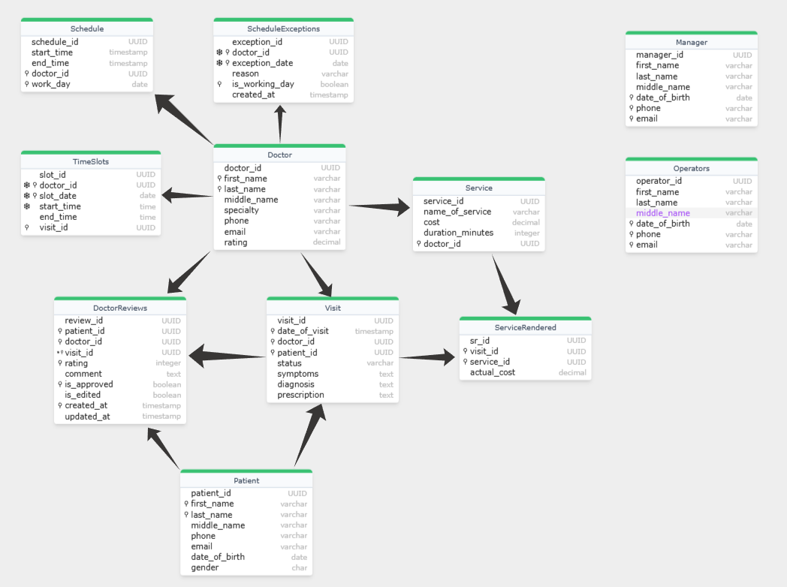
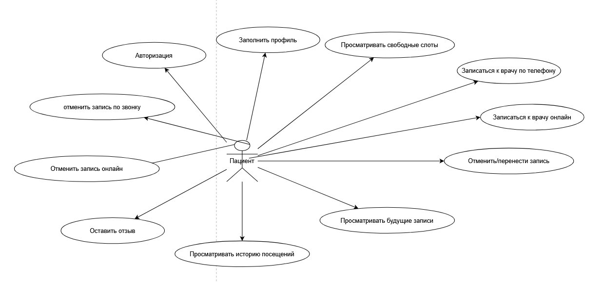
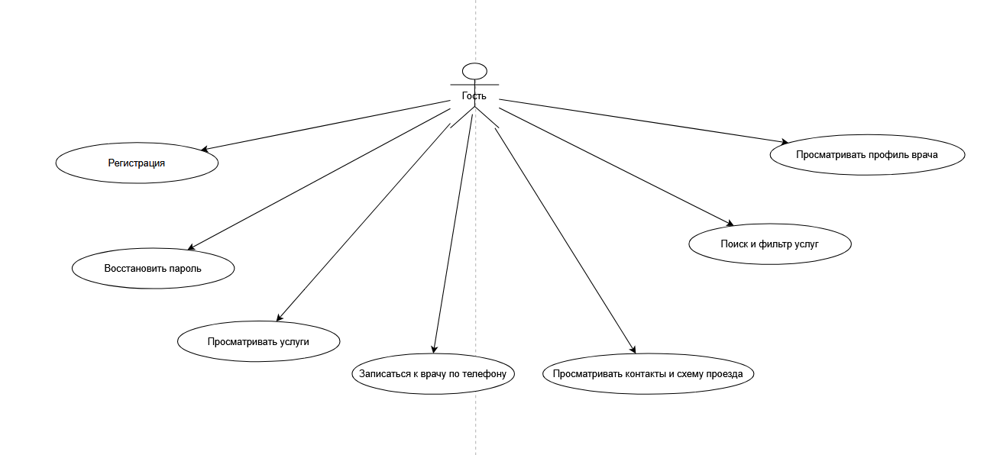
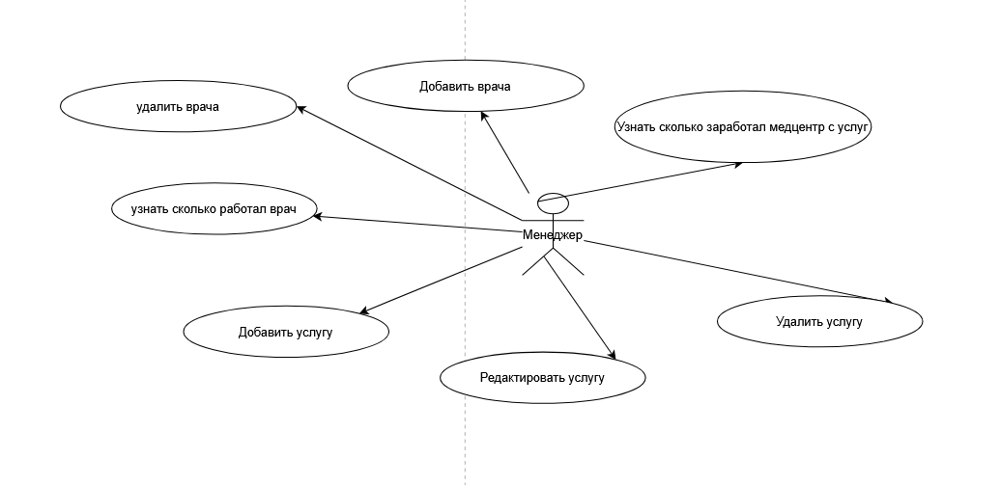
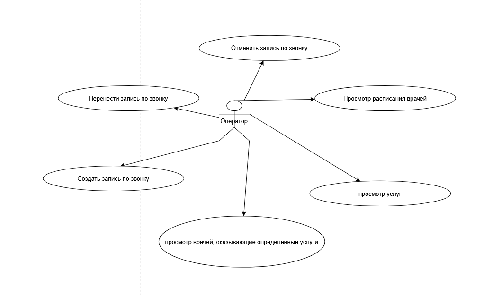

# Backend (pt_backend)

## Краткое описание

Backend сервиса для веб‑приложения "Медицинский центр" — REST API для управления пользователями, врачами, услугами, расписанием и записями, авторизации по номеру телефона (SMS-код), рассылки уведомлений и формирования отчетов для менеджеров.

Проект реализует функции, описанные в требованиях заказчика: онлайн‑запись, личные кабинеты пациентов и врачей, роли (Guest/Patient/Doctor/Operator/Manager/System), модерация отзывов, генерация отчетов и интеграции (SMS, e‑mail).

## Технологии

* Java 21+ и Spring Boot
* Hibernate / JPA
* PostgreSQL
* Docker / Docker Compose
* Maven
* JUnit 5 (unit/integration tests)

## Архитектура

## Роли пользователей и их действия

## Medical Center API Endpoints

### Patients
- `GET /patients`
- `GET /patients/{id}`
- `GET /patients/search/by-lastname?lastName={lastName}`
- `GET /patients/search/by-fullname?lastName={lastName}&firstName={firstName}&middleName={middleName}`
- `GET /patients/search/by-phone?phone={phone}`
- `POST /patients`
- `PUT /patients/{id}`
- `DELETE /patients/{id}`

### Doctors
- `GET /doctors`
- `GET /doctors/{id}`
- `GET /doctors/search/by-specialty?specialty={specialty}`
- `GET /doctors/search/by-rating?minRating={minRating}`
- `GET /doctors/{id}/rating`
- `GET /doctors/{id}/rating/stats`
- `POST /doctors`
- `PUT /doctors/{id}`
- `DELETE /doctors/{id}`

### Services
- `GET /services`
- `GET /services/{id}`
- `GET /services/search/by-doctor?doctorId={doctorId}`
- `GET /services/search/by-cost?minCost={minCost}&maxCost={maxCost}`
- `POST /services`
- `PUT /services/{id}`
- `DELETE /services/{id}`

### Visits
- `GET /visits`
- `GET /visits/{id}`
- `GET /visits/search/by-doctor?doctorId={doctorId}`
- `GET /visits/search/by-patient?patientId={patientId}`
- `GET /visits/search/by-status?status={status}`
- `POST /visits`
- `PUT /visits/{id}`
- `DELETE /visits/{id}`

### Schedule
- `GET /schedules`
- `GET /schedules/search/by-doctor?doctorId={doctorId}`
- `GET /schedules/search/by-date?workDay={yyyy-MM-dd}`
- `POST /schedules`
- `PUT /schedules/{id}`
- `DELETE /schedules/{id}`

### TimeSlots
- `GET /timeslots`
- `GET /timeslots/search/by-doctor?doctorId={doctorId}`
- `GET /timeslots/available`
- `GET /timeslots/available/by-doctor?doctorId={doctorId}`
- `GET /timeslots/search/by-date?slotDate={yyyy-MM-dd}`
- `PUT /timeslots/{id}/book?visitId={visitId}`
- `PUT /timeslots/{id}/release`

### DoctorReviews
- `GET /reviews`
- `GET /reviews/search/by-doctor?doctorId={doctorId}`
- `GET /reviews/search/by-patient?patientId={patientId}`
- `GET /reviews/search/by-visit?visitId={visitId}`
- `POST /reviews`
- `PUT /reviews/{id}/approve`
- `PUT /reviews/{id}`
- `DELETE /reviews/{id}`

### ServiceRendered
- `GET /service-rendered`
- `GET /service-rendered/search/by-visit?visitId={visitId}`
- `GET /service-rendered/visit/{visitId}/total-cost`
- `POST /service-rendered`

### ScheduleExceptions
- `GET /schedule-exceptions`
- `GET /schedule-exceptions/search/by-doctor?doctorId={doctorId}`
- `POST /schedule-exceptions`

### Operators
- `GET /operators`
- `POST /operators`

### Managers
- `GET /managers`
- `POST /managers`

### Common Parameters
- `page` - page number (starts from 0)
- `size` - page size (default: 20)
- `sort` - sorting field (e.g., `lastName,asc`)

## Документация API с использованием Swagger
Этот проект использует Swagger (OpenAPI 3.0) для документирования REST API. Документация предоставляет интерактивный интерфейс для исследования всех доступных эндпоинтов, схем запросов/ответов и возможности тестирования.

### Точки доступа к документации
#### 1. Swagger UI (Интерактивная документация)
* URL: http://localhost:8080/swagger-ui.html
* Описание: Интерактивный веб-интерфейс для исследования и тестирования API эндпоинтов
* Возможности: просмотр всех доступных эндпоинтов, сгруппированных по категориям, просмотр детальных схем запросов и ответов, выполнение API вызовов напрямую из браузера, просмотр требований аутентификации, скачивание спецификаций API

#### 2. OpenAPI JSON спецификация
* URL: http://localhost:8080/api-docs
* Описание: Сырая спецификация OpenAPI в формате JSON
* Использование: импорт в API клиенты, генерация клиентских библиотек, интеграция с инструментами тестирования API, конфигурация API шлюзов

#### 3. OpenAPI YAML спецификация
* URL: http://localhost:8080/api-docs.yaml
* Описание: Сырая спецификация OpenAPI в формате YAML
* Использование: Альтернативный формат для инструментов, предпочитающих YAML

### Использование Swagger UI
* Навигация
1. Откройте http://localhost:8080/swagger-ui.html в вашем браузере
2. Раскройте секции, нажимая на названия категорий (например, "Patients Management", "Doctors Management")
3. Просмотрите доступные эндпоинты для каждой секции

* Тестирование эндпоинтов
1. Нажмите на любой эндпоинт, чтобы раскрыть его детали
2. Нажмите кнопку "Try it out" для включения режима тестирования
3. Заполните необходимые параметры: параметры пути (в URL), параметры запроса, тело запроса (для POST/PUT запросов)
4. Нажмите "Execute" для отправки запроса
5. Просмотрите ответ, включая HTTP статус код, тело ответа, заголовки ответа, эквивалент curl команды

* Понимание документации эндпоинтов
Каждый эндпоинт показывает:
1. HTTP Метод (GET, POST, PUT, DELETE)
2. Путь эндпоинта с параметрами
3. Описание того, что делает эндпоинт
4. Параметры с типами, требованиями и примерами
5. Схему тела запроса (для POST/PUT)
6. Схемы ответов для разных статус кодов
7. Требования аутентификации

### Группы API (Теги)
Swagger документация выполнена для следующих групп API:
* Patients Management - CRUD операции с пациентами и поиск
* Doctors Management - Управление врачами и специализациями
* Visits Management - Запись на прием и отслеживание визитов
* Services Management - Медицинские услуги и процедуры
* Schedule Management - Расписание врачей и доступность
* Reviews Management - Отзывы пациентов и рейтинги
* Staff Management - Операторы и менеджеры

### Генерация клиентского кода
Использование OpenAPI Generator
bash
* Генерация Java клиента:
`openapi-generator generate -i http://localhost:8080/api-docs -g java -o ./medicalcenter-client`

* Использование swagger-codegen
bash
`swagger-codegen generate -i http://localhost:8080/api-docs -l java -o ./medicalcenter-client`
