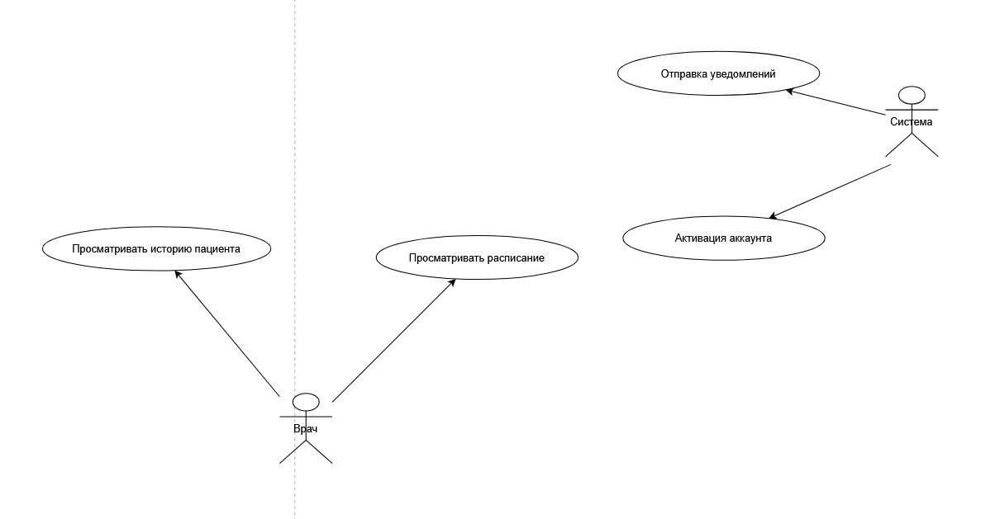

# Backend (pt_backend)

## Краткое описание

Backend сервиса для веб‑приложения "Медицинский центр" — REST API для управления пользователями, врачами, услугами, расписанием и записями, авторизации по номеру телефона (SMS-код), рассылки уведомлений и формирования отчетов для менеджеров.

Проект реализует функции, описанные в требованиях заказчика: онлайн‑запись, личные кабинеты пациентов и врачей, роли (Guest/Patient/Doctor/Operator/Manager/System), модерация отзывов, генерация отчетов и интеграции (SMS, e‑mail).

## Технологии

* Java 21+ и Spring Boot
* Hibernate / JPA
* PostgreSQL
* Docker / Docker Compose
* Maven
* JUnit 5 (unit/integration tests)

## Архитектура

## Роли пользователей и их действия

## API
1. /api/v1/patients
2. /api/v1/patients/{id}
3. /api/v1/doctors
4. /api/v1/doctors/{id}
5. /api/v1/specializations
6. /api/v1/visits/{id}/status
7. /api/v1/schedules/doctor/{id}
8. /api/v1/services/{id}
9. /api/v1/operators/{id}
10. /api/v1/managers