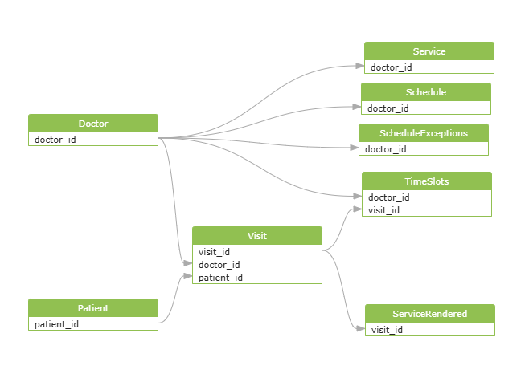

# Backend (pt_backend)

## Краткое описание

Backend сервиса для веб‑приложения "Медицинский центр" — REST API для управления пользователями, врачами, услугами, расписанием и записями, авторизации по номеру телефона (SMS-код), рассылки уведомлений и формирования отчетов для менеджеров.

Проект реализует функции, описанные в требованиях заказчика: онлайн‑запись, личные кабинеты пациентов и врачей, роли (Guest/Patient/Doctor/Operator/Manager/System), модерация отзывов, генерация отчетов и интеграции (SMS, e‑mail).

## Технологии

* Java 21+ и Spring Boot
* Hibernate / JPA
* PostgreSQL
* Docker / Docker Compose
* Maven
* JUnit 5 (unit/integration tests)

## Архитектура




## Быстрый старт (локально)

1. Склонировать репозиторий:

```bash
git clone git@github.com:org/pt_backend.git
cd pt_backend
```

2. Создать `.env` (пример в `.env.example`) и задать переменные:

* `SPRING_DATASOURCE_URL` (Postgres)
* `SPRING_DATASOURCE_USERNAME`
* `SPRING_DATASOURCE_PASSWORD`
* SMS / EMAIL провайдеры (API ключи)
* `SMS_CODE_TTL_ACTIVATION=24h`
* `SMS_CODE_TTL_RESET=1h`
* `SESSION_TIMEOUT=24h`

3. Запустить БД (Docker Compose):

```bash
docker-compose up -d postgres
```

4. Запустить приложение:

```bash
mvn clean spring-boot:run
```

или собрать Docker image:

```bash
docker build -t pt_backend .
docker-compose up -d
```

## Конфигурационные и нефункциональные требования

* Валидация номеров телефонов и паролей (пароль ≥ 8 символов).
* Время жизни кода активации — 24 часа; кода для сброса — 1 час; повторная отправка не чаще 1 раза в минуту
* Сессия — 24 часа неактивности (конфигурируемо); после logout токены отзываются.
* Обновление списка услуг/фильтров — отклик ≤ 500 мс под нагрузкой 200 одновременных пользователей.
* Синхронное отражение занятых слотов — слот должен исчезать у других пользователей ≤ 2 с.
* Отправка писем при создании/переносе/напоминании — в течение ≤ 60 с с retry (до 3 попыток).

## Тесты

* Unit tests: `mvn test`
* Integration tests: запускаются с профилем `integration` (пример: поднять тестовую БД через Testcontainers).

## CI / CD

* Рекомендация: GitHub Actions

  * `lint` → `build` → `test` → `build docker image` → `push` → `deploy`.

## Безопасность и соответствие

* Шифрование конфиденциальных данных в БД по необходимости.
* Логирование доступа и действий в журнал аудита.
* Ограничение доступа по ролям и ясные проверки прав.

## Экспорт/Отчеты

* Формирование отчетов по выручке/врачам/услугам; экспорт XLSX и CSV.
* Отчёт должен учитывать визиты в статусе `completed` и группировать по врачам/услугам.

## Contribution

* Fork → feature branch → PR с описанием и тестами → code review.

## Контакты

* Руководитель проекта: Войтеховская Дарья Александровна
